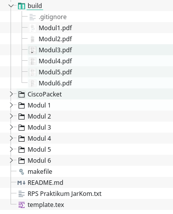

# ModulLabJarkom
Modul Lab Jaringan Komputer

Oleh Diky Wahyudi

## Compiler

Compiler yang digunakan untuk melakukan build adalah `pdflatex`

### Windows
TexLive https://tug.org/texlive/windows.html

Miktex https://miktex.org/

### Linux

https://tug.org/texlive/quickinstall.html

### Mac

https://tug.org/mactex/

## Cara build module menjadi pdf

Jalankan perintah `make` untuk melakukan build semua modul menjadi pdf

> `make`

Pada folder build akan dihasilkan file modul dalam bentuk pdf

> 